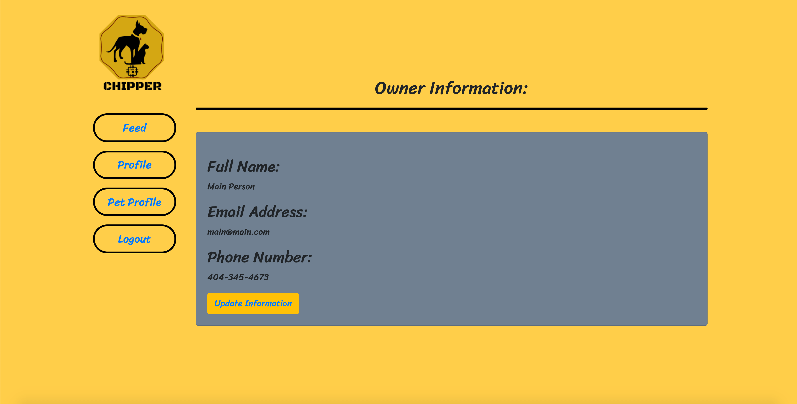

# CHIPPER

Making pet and owner reunification possible.

# Description

Our project was designed and created to display our group coordination & collective development skills. The front-end is developed with React.js & the bootstrap CDN to deliver a cutting edge and responsive UI. Our user interactivity was accomplished with leveraging vanilla Javascript. We assign user-data to a personal identifier number and allow our users to make address, contact, health record and many other changes. The goal was to create an EASY, USER FRIENDLY way to update your contact information. We solve, pets microchip information being delinquent.

# Usage - Pet Owner

Upon entering our site, you will be asked to register an account. Just give us a few critical details so we can help keep your information accurate. After signing up and logging in, we will direct you to the dashboard. From the dashboard, you can update your contact information and pets health records with the click of a button (Update Information).  
The navigation tab on the left will direct you to your local communities news feed.
THE FEED: is where our community and and and update posts about lost and reunified pets. This is a great tool to help your neighbors stay informed on local, lost pet information.
THE PET PROFILE: is where you can add a pet to your chipper family. Just grab the microchip # from your documentation were you got your pet chipped, or visit your veterinarian and ask them to scan your pet for the number.

<!-- GIF OF NAVIGATION FROM HOME TO, FEED & PET PROFILE WITH SEEDED DATA -->

<!-- 

  <a href="https://file-fish.herokuapp.com/" style="font-size: 45px">CHIPPER</a>
    
  

 -->

<!-- PICTURE OF FEED -->

<!-- 

   <a href="https://file-fish.herokuapp.com/" style="font-size: 45px">CHIPPER</a>
    
  

 -->

<!-- PICTURE OF PET PROFILE -->

<!-- 

  <a href="https://file-fish.herokuapp.com/" style="font-size: 45px">CHIPPER</a>
    
  

 -->

# Usage - Vet & Humane Society

After contacting the CHIPPER team, we will evaluate your EIN, and Veterinarian Medical License.
Upon completion and approval, we will send out your welcome email with instructions on getting started.  
Your Practice or Humane Society office manager, will receive a unique and one-time-use Admin-Key. While signing up we ask that you have this key ready to enter. The key will be used to log your user name and password, then give you access to our pet finder database. We will automatically direct you to the pet-finder-dashboard upon a login-approval. When you recover a lost dog, simply scan and retain the MicroChip number as usual. Login to your CHIPPER account and enter the MicroChip number. We will display most recent Pet owner data, please continue to follow guidelines on questioning the pet owner to confirm identity, as you always have.
We also ask that you make a post in the Feed as to alert the local community that a dog was found at your office/practice location.

<!-- PHOTO OF USER - HOME -->

  <!-- <b>Visit Live Site</b>  -->
  <a href="https://evening-mountain-29318.herokuapp.com/" style="font-size: 45px">CHIPPER</a> 
    
  

# User Solutions

Pet Microchipping has been around since the late 90's, but there has always been one fatal flaw to the system. As a pet owner, it has always & always was a hassle to update your contact information. This one simple issue created a pit-fall for pet reunification. When database information displays delinquent information, such as; old home addresses, old phone numbers or email addresses, the vet or humane society is left with no options. The pet unfortunately falls into the adoption cycle and is almost never reunited with their original family after that point.

Now with the use of CHIPPER and our partnerships with the american humane society & countless veterinarian practices, we have a solution. By allowing our users to update their contact information easily and from their phone or home computer, we lower the number of lost pets. The utilization of our FEED: allows user to stay connected with their local communities, vet practices and humane societys.

# Resources

Rick and Morty api: https://rickandmortyapi.com/
Utelly api: https://rapidapi.com/utelly/api/utelly
Geolocation api: https://developer.mozilla.org/en-US/docs/Web/API/Geolocation_API
Materialize CSS: https://materializecss.com/
Reverse Geo-location: https://rapidapi.com/Noggle/api/reverse-geocoding-and-geolocation-service

# Contributors

- [Alan Margolies: GitHub](https://github.com/amargolies88)  
  [LinkedIn](https://www.linkedin.com/in/alan-margolies-218105190/)
- [Austin Atkinson: GitHub](https://github.com/austinatkinson93) 
  [LinkedIn](https://www.linkedin.com/in/austin-atkinson1993/)
- [John Sasser: GitHub](https://github.com/JohnSasser) 
  [LinkedIn](https://www.linkedin.com/in/john-sasser-does-javascript/)
- [Rami Forde: GitHub](https://github.com/rforde1) 
  [LinkedIn](https://www.linkedin.com/in/rami-forde-6010a0197/)

# Project Group Banter

    -   ALGORITHM OF SUCCESS
    while(noSuccess){
        tryAgain();
    if(dead)
    break();
    }
